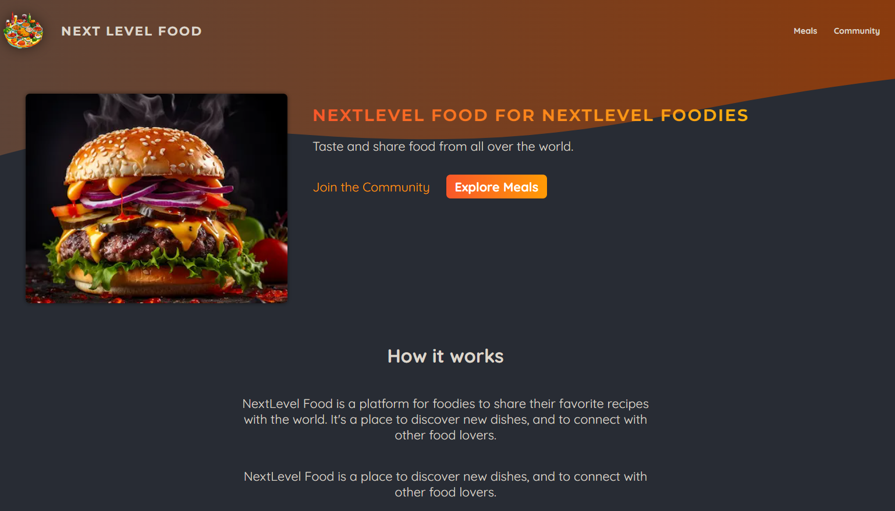

# Food Recipe Sharing App

## Description

 
    A simple food recipe sharing app that allows users to create, read, update and delete their own recipes and view other users' recipes

## Live Version

[Website](https://foodies.ivanderlich.com/)

## Instalation

    git clone git@github.com:IvanDerlich/foodies.git

    cd foodies

    npm install

    npm run dev

## Technologies used

<ul id="tech-list-foodies">
  <li>Next.js</li>
  <li>Postgresql</li>
  <li>better-sqlite3</li>
  <li>basic-ftp</li>
  <li>react-toastify</li>
</ul>

## [Youtube Video]()

## Preview

### Home

  

### Meal List

  

### Food Recipe

  

### Consirations

  

### Food Recipe Creation Form

  

### Page Description

  

## Author

[Ivan Derlich](https://www.ivanderlich.com)

## Ackownledgments

- [Maximilian Schwarzmüller](https://maximilian-schwarzmueller.com/): This project is was done while following [his udemy tutorial](https://www.udemy.com/course/nextjs-react-the-complete-guide)
- The builders of the technologies we take for granted while programming applications like this one.

## [Repository](https://github.com/IvanDerlich/foodies)
